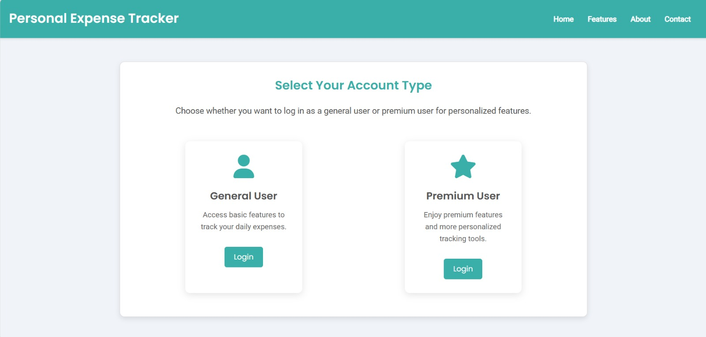
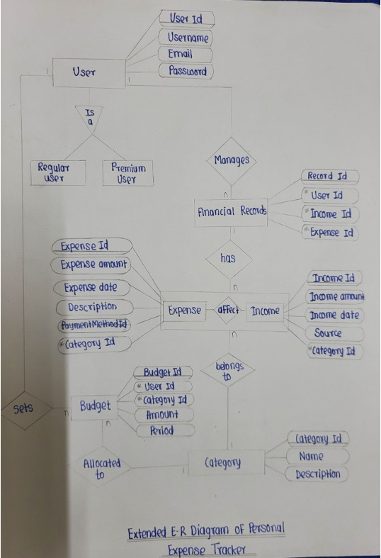
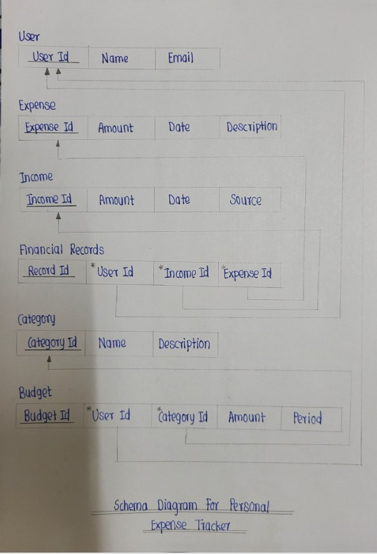

# Personal Expense Tracker

A web-based personal expense tracker that allows users to log daily expenses, categorize them, manage income and budgets, and gain insights into spending habits.

Built with **PHP**, **MySQL**, **HTML/CSS**, and **JavaScript**.


---

## Table of Contents

- [Features](#features)
- [Tech Stack](#tech-stack)
- [Architecture](#architecture)
- [Database Design](#database-design)
- [Screenshots](#screenshots)
- [Getting Started](#getting-started)
  - [Prerequisites](#prerequisites)
  - [Installation](#installation)
  - [Using Docker](#using-docker)
- [Project Structure](#project-structure)
- [Usage](#usage)
- [License](#license)

---

## Features

- **Expense Logging** -- Record daily expenses with amount, date, description, and category
- **Income Management** -- Track multiple income sources with date and amount
- **Budget Management** -- Set and monitor budgets per category (weekly/monthly/yearly)
- **CRUD Operations** -- Add, update, and delete expenses, income, and budgets
- **User Specialization** -- General and Premium user account types
- **Login System** -- User authentication with login/logout flow
- **Responsive UI** -- Clean, mobile-friendly interface with teal-themed design

---

## Tech Stack

| Layer          | Technology            |
|----------------|-----------------------|
| Frontend       | HTML5, CSS3, JavaScript |
| Backend        | PHP                   |
| Database       | MySQL                 |
| Server         | Apache (XAMPP/WAMP/Docker) |

---

## Architecture

```
┌─────────────────────────────────────────────┐
│              Presentation Layer             │
│          (HTML, CSS, JavaScript)            │
│   login.html / DBMS.php / specialisation   │
└──────────────────┬──────────────────────────┘
                   │
┌──────────────────▼──────────────────────────┐
│            Business Logic Layer             │
│                  (PHP)                      │
│  add_expense / add_income / add_budget     │
│  update_* / delete_* / db_connection       │
└──────────────────┬──────────────────────────┘
                   │
┌──────────────────▼──────────────────────────┐
│               Data Layer                    │
│              (MySQL)                        │
│  expenses / income / budgets / users       │
└─────────────────────────────────────────────┘
```

For detailed architecture diagrams, see [docs/architecture.md](docs/architecture.md).

---

## Database Design

The application uses 6 core tables:

| Table              | Purpose                                      |
|--------------------|----------------------------------------------|
| `User`             | Stores user credentials and profile info     |
| `Category`         | Expense/income categories                    |
| `Income`           | Income records with amount, date, source     |
| `Expense`          | Expense records with amount, date, category  |
| `FinancialRecords` | Links users to their income and expenses     |
| `Budget`           | Budget limits per category and period        |

See [docs/database-design.md](docs/database-design.md) for the full ER diagram and schema details.

---

## Screenshots

### Login Page


### ER Diagram


### Schema Diagram


---

## Getting Started

### Prerequisites

- **PHP** >= 7.4
- **MySQL** >= 5.7
- **Apache** web server (or use XAMPP/WAMP/MAMP)
- Alternatively, **Docker** and **Docker Compose**

### Installation

1. **Clone the repository**
   ```bash
   git clone https://github.com/jineshagandhi/personal-expense-tracker.git
   cd personal-expense-tracker
   ```

2. **Set up the database**
   ```bash
   mysql -u root -p < database/schema.sql
   mysql -u root -p expense_tracker < database/seed.sql
   ```

3. **Configure database connection**

   Copy the example env file and update credentials:
   ```bash
   cp .env.example .env
   ```
   Then update `db_connection.php` with your MySQL credentials.

4. **Start the server**

   If using XAMPP/WAMP, place the project in the `htdocs` directory and navigate to:
   ```
   http://localhost/personal-expense-tracker/specialisation.html
   ```

### Using Docker

```bash
docker-compose up -d
```

The app will be available at `http://localhost:8080`.

---

## Project Structure

```
personal-expense-tracker/
├── database/
│   ├── schema.sql              # Database DDL statements
│   └── seed.sql                # Sample data for testing
├── docs/
│   ├── architecture.md         # System architecture diagrams
│   └── database-design.md      # ER diagram and schema docs
├── screenshots/                # UI screenshots
├── add_budget.php              # Add new budget
├── add_expense.php             # Add new expense
├── add_income.php              # Add new income
├── db_connection.php           # MySQL database connection
├── DBMS.php                    # Main dashboard page
├── dbmsstyles.css              # Application styles
├── delete_budget.php           # Delete budget
├── delete_expense.php          # Delete expense
├── delete_income.php           # Delete income
├── display_expenses.php        # Display expenses
├── login.html                  # Login page
├── specialisation.html         # User type selection page
├── update_budget.php           # Update budget
├── update_expense.php          # Update expense
├── update_income.php           # Update income
├── budget.png                  # Logo/budget icon
├── expense.jpeg                # Welcome page image
├── docker-compose.yml          # Docker setup
├── .env.example                # Environment config template
├── .gitignore                  # Git ignore rules
├── LICENSE                     # MIT License
└── README.md                   # Project documentation
```

---

## Usage

1. Open `specialisation.html` to choose account type (General / Premium)
2. Log in through the login page
3. Use the dashboard to:
   - Add/edit/delete expenses
   - Add/edit/delete income
   - Set and manage budgets per category
   - View all financial records in tabular format
4. Logout when done

---

## License

This project is licensed under the MIT License. See [LICENSE](LICENSE) for details.

---

 
