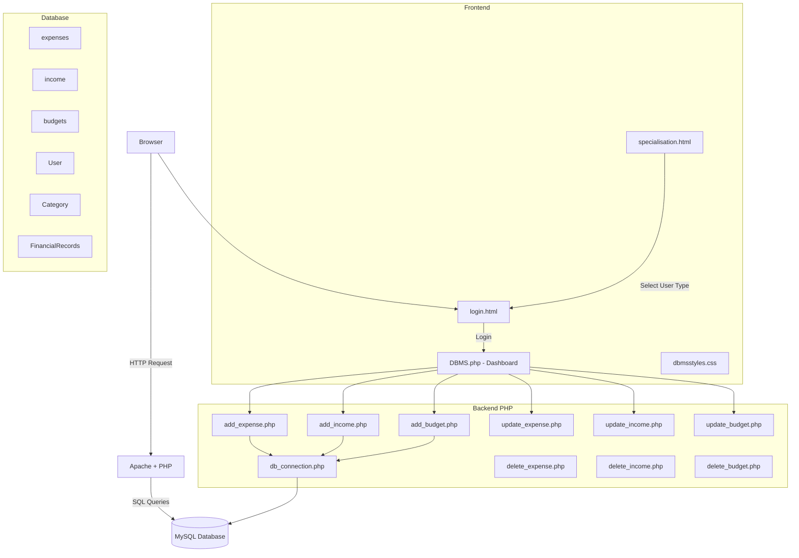
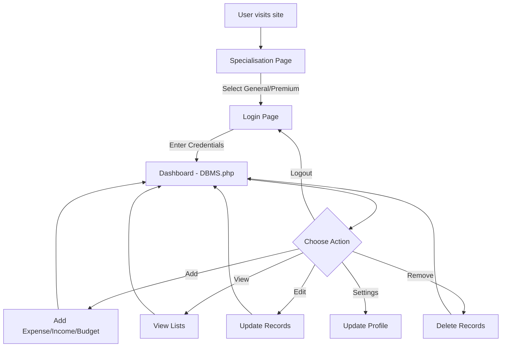

# System Architecture

## Overview

The Personal Expense Tracker follows a classic **3-tier architecture** pattern:

```
┌─────────────────────────────────────────────────────┐
│                   Client (Browser)                  │
└──────────────────────┬──────────────────────────────┘
                       │ HTTP
┌──────────────────────▼──────────────────────────────┐
│              Apache Web Server                      │
│  ┌────────────────────────────────────────────┐     │
│  │          Presentation Layer                │     │
│  │   login.html  specialisation.html          │     │
│  │   DBMS.php    dbmsstyles.css               │     │
│  └──────────────────┬─────────────────────────┘     │
│  ┌──────────────────▼─────────────────────────┐     │
│  │         Business Logic Layer (PHP)         │     │
│  │   add_expense.php    delete_expense.php    │     │
│  │   add_income.php     delete_income.php     │     │
│  │   add_budget.php     delete_budget.php     │     │
│  │   update_expense.php update_income.php     │     │
│  │   update_budget.php  db_connection.php     │     │
│  └──────────────────┬─────────────────────────┘     │
└──────────────────────┼──────────────────────────────┘
                       │ MySQL Protocol
┌──────────────────────▼──────────────────────────────┐
│               Data Layer (MySQL)                    │
│                                                     │
│   User  Category  Income  Expense                   │
│   FinancialRecords  Budget                          │
│                                                     │
│   Stored Procedures  Functions  Triggers            │
└─────────────────────────────────────────────────────┘
```

## Component Diagram



## User Flow



## Request-Response Flow

1. User opens `specialisation.html` and selects account type
2. User is redirected to `login.html` for authentication
3. After login, `DBMS.php` loads as the main dashboard
4. Dashboard fetches data from MySQL via `db_connection.php`
5. CRUD actions are handled by individual PHP files that redirect back to the dashboard

## Docker Architecture

When using Docker Compose, three containers run:

| Container | Image | Port | Purpose |
|-----------|-------|------|---------|
| `expense-tracker-web` | php:8.1-apache | 8080 | PHP app server |
| `expense-tracker-db` | mysql:8.0 | 3307 | MySQL database |
| `expense-tracker-pma` | phpmyadmin | 8081 | Database admin UI |
