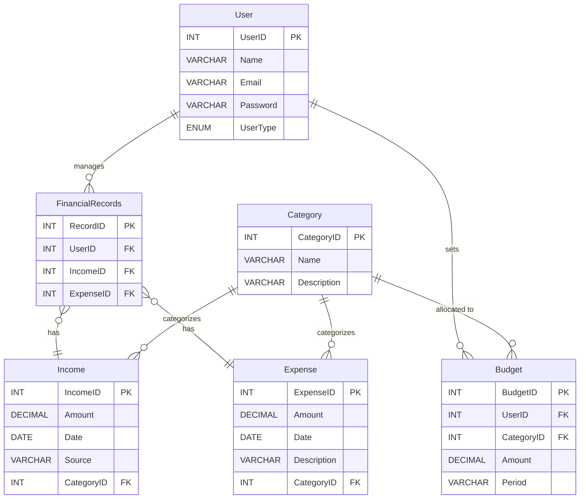

# Database Design

## ER Diagram



## Relationships and Cardinality

| Relationship | Entities | Cardinality | Description |
|---|---|---|---|
| Manages | User - FinancialRecords | 1:N | One user manages many financial records |
| Belongs to | Income/Expense - Category | N:1 | Many transactions belong to one category |
| Sets | User - Budget | 1:N | One user can have multiple budgets |
| Allocated to | Budget - Category | N:1 | A budget is for one category; a category can have many budgets |

## Generalization / Specialization

- **User** is generalized into **Regular User** and **Premium User**
- Premium users have access to advanced features

## Aggregation

- **FinancialRecords** acts as an aggregation of **Income** and **Expense** entities, linking them to a specific user

## Primary Keys

| Table | Primary Key |
|---|---|
| User | UserID |
| Category | CategoryID |
| Income | IncomeID |
| Expense | ExpenseID |
| FinancialRecords | RecordID |
| Budget | BudgetID |

## Foreign Keys

| Table | Foreign Key | References |
|---|---|---|
| FinancialRecords | UserID | User(UserID) |
| FinancialRecords | IncomeID | Income(IncomeID) |
| FinancialRecords | ExpenseID | Expense(ExpenseID) |
| Income | CategoryID | Category(CategoryID) |
| Expense | CategoryID | Category(CategoryID) |
| Budget | UserID | User(UserID) |
| Budget | CategoryID | Category(CategoryID) |

## Stored Procedures

| Procedure | Purpose |
|---|---|
| `AddIncome(amount, date, source, categoryID)` | Insert a new income record |
| `DeleteExpense(expenseID)` | Delete an expense by ID |

## Functions

| Function | Purpose |
|---|---|
| `GetTotalIncome(userID)` | Returns total income for a user |
| `GetNetBalance(userID)` | Returns net balance (income - expenses) |

## Triggers

| Trigger | Event | Purpose |
|---|---|---|
| `AfterIncomeInsert` | AFTER INSERT on Income | Auto-creates a FinancialRecords entry |

## Schema Diagram

```
┌──────────────┐     ┌──────────────────┐     ┌──────────────┐
│    User      │     │ FinancialRecords │     │   Income     │
├──────────────┤     ├──────────────────┤     ├──────────────┤
│ UserID (PK)  │◄────│ UserID (FK)      │     │ IncomeID(PK) │
│ Name         │     │ RecordID (PK)    │────►│ Amount       │
│ Email        │     │ IncomeID (FK)  ──┼─────│ Date         │
│ Password     │     │ ExpenseID (FK) ──┼──┐  │ Source       │
│ UserType     │     └──────────────────┘  │  │ CategoryID   │──┐
└──────┬───────┘                           │  └──────────────┘  │
       │                                   │                    │
       │         ┌──────────────┐          │  ┌──────────────┐  │
       │         │   Expense    │◄─────────┘  │  Category    │  │
       │         ├──────────────┤             ├──────────────┤  │
       │         │ ExpenseID(PK)│             │CategoryID(PK)│◄─┘
       │         │ Amount       │             │ Name         │
       │         │ Date         │             │ Description  │
       │         │ Description  │             └──────┬───────┘
       │         │ CategoryID ──┼─────────────────────┘
       │         └──────────────┘
       │
       │         ┌──────────────┐
       └────────►│   Budget     │
                 ├──────────────┤
                 │ BudgetID(PK) │
                 │ UserID (FK)  │
                 │ CategoryID   │──► Category
                 │ Amount       │
                 │ Period       │
                 └──────────────┘
```
